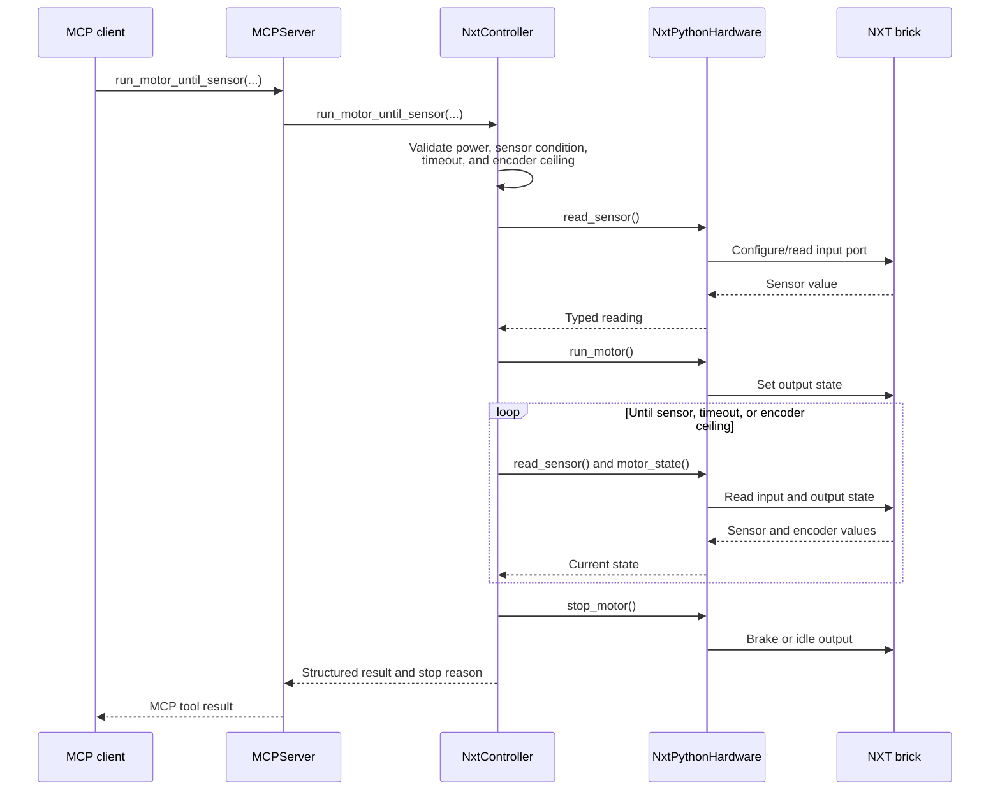
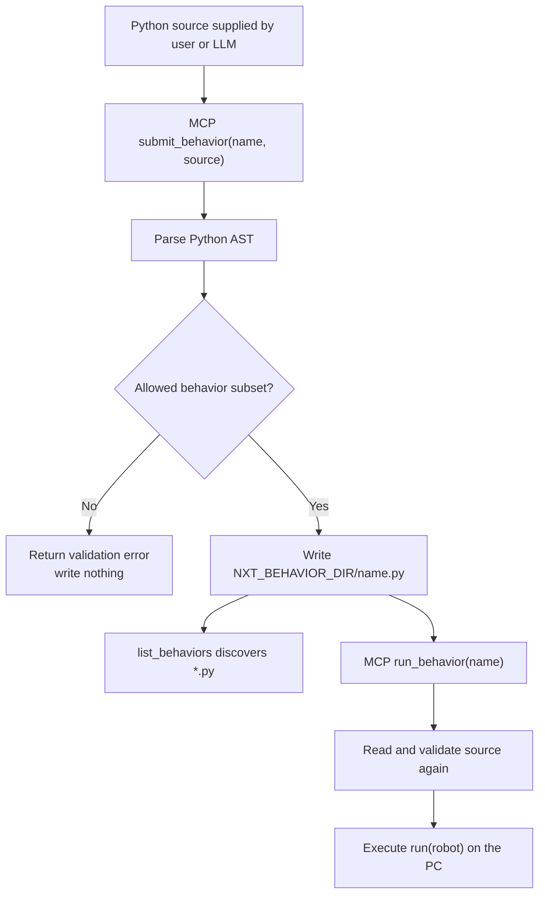
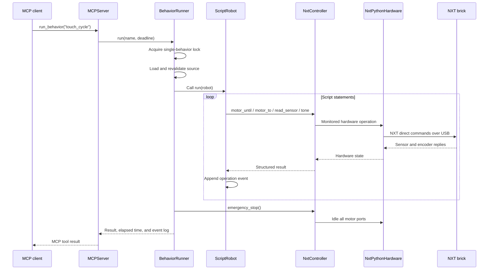
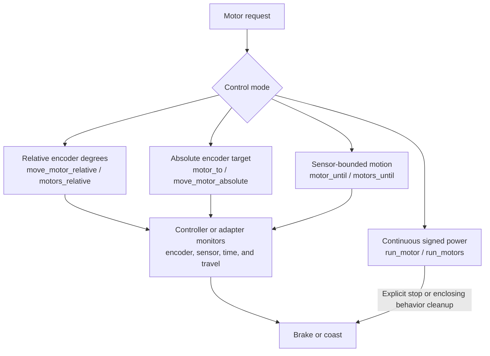
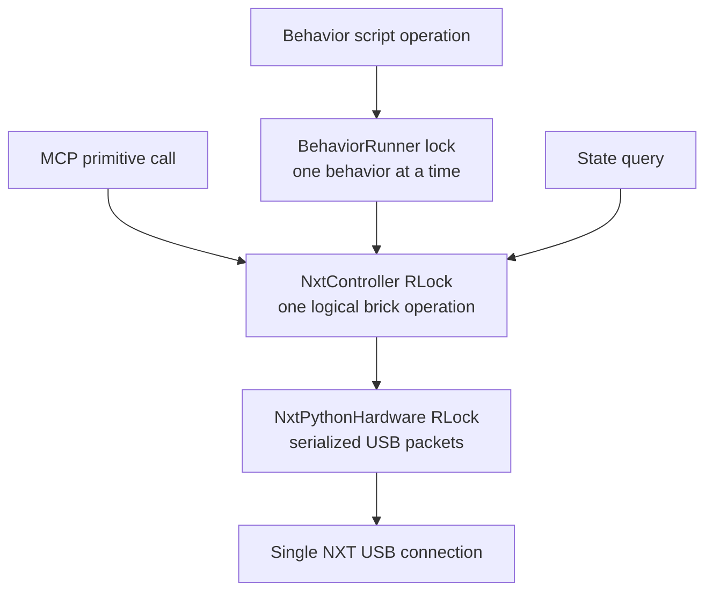
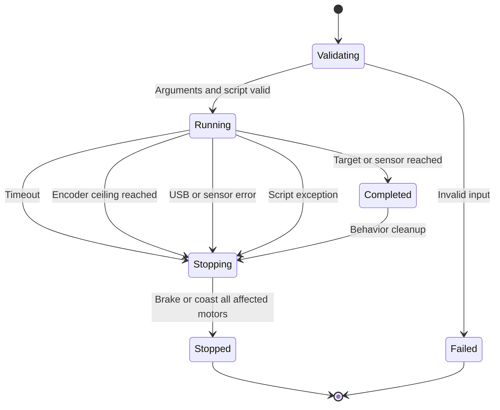
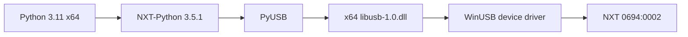
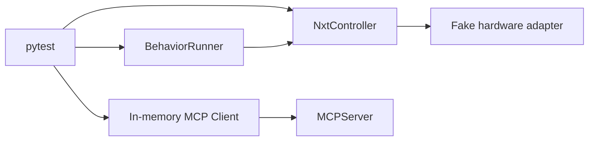

# Robot NXT Control MCP architecture

## Purpose

Robot NXT Control MCP lets an MCP client control a compatible programmable brick connected
to a Windows PC by USB. The PC owns the control loop. The brick runs its stock firmware
and receives its documented direct commands; it does not execute Python.

LEGO, MINDSTORMS, and NXT are trademarks of the LEGO Group. This independent project
uses those names only when needed to identify compatible hardware, protocols, or
third-party dependencies, and is not affiliated with, sponsored by, or endorsed by the
LEGO Group.

The system supports two ways to request behavior:

1. Call an MCP motor, sensor, state, program, or tone primitive directly.
2. Register and run a restricted Python behavior on the PC. The behavior composes the
   same monitored robot primitives and cannot communicate with USB directly.

## Runtime context

```mermaid
flowchart LR
    Client["MCP client / LLM host"]
    Transport["MCP stdio transport"]
    Server["MCPServer<br/>server.py"]
    Controller["NxtController<br/>controller.py"]
    Hardware["NxtHardware interface<br/>hardware.py"]
    Adapter["NxtPythonHardware adapter<br/>nxt_python_adapter.py"]
    PyUSB["NXT-Python + PyUSB"]
    LibUSB["libusb-1.0.dll"]
    WinUSB["Windows WinUSB driver"]
    Brick["Compatible programmable brick<br/>stock firmware"]
    IO["Motors A-C<br/>Sensors S1-S4"]

    Client -->|JSON-RPC MCP requests| Transport
    Transport --> Server
    Server -->|validated tool arguments| Controller
    Controller --> Hardware
    Hardware --> Adapter
    Adapter --> PyUSB
    PyUSB --> LibUSB
    LibUSB --> WinUSB
    WinUSB -->|USB direct commands| Brick
    Brick --> IO
```



The main seam is the `NxtHardware` interface. `NxtController` depends on that interface,
not on NXT-Python. The production `NxtPythonHardware` adapter satisfies it; tests use a
fake adapter at the same seam.

## Modules and responsibilities

| Module | Interface and responsibility |
| --- | --- |
| [`server.py`](src/nxt_mcp/server.py) | Declares MCP tools, validates their schemas through MCP, and delegates requests. It contains no USB control loops. |
| [`controller.py`](src/nxt_mcp/controller.py) | Owns motor and sensor semantics, argument validation, encoder monitoring, timeouts, stop conditions, absolute positioning, group operations, and USB-operation serialization. |
| [`hardware.py`](src/nxt_mcp/hardware.py) | Defines the hardware seam used by the controller. It describes brick, motor, sensor, program, snapshot, and tone capabilities. |
| [`nxt_python_adapter.py`](src/nxt_mcp/nxt_python_adapter.py) | Adapts the hardware interface to NXT-Python, PyUSB, and the original NXT direct-command protocol. It caches configured sensors and performs tight encoder polling. |
| [`behaviors.py`](src/nxt_mcp/behaviors.py) | Validates, stores, loads, and executes restricted PC-side Python behaviors. It provides the script-visible `robot` interface. |
| [`behaviors/`](behaviors) | Default registration directory. One `<name>.py` file represents one registered behavior. |
| [`mcp-behavior-client.py`](scripts/mcp-behavior-client.py) | Example MCP stdio client for listing, submitting, retrieving, and running behaviors. It never imports the controller. |

## Direct MCP primitive call

A direct MCP tool call performs one requested operation. Long-running motor tools keep
their control loop inside the controller or hardware adapter; the MCP client does not
poll the sensor or encoder itself.



## Behavior registration

A behavior is a Python source file stored on the PC. It is registered by name, validated
before writing, and validated again before every execution.



The default behavior directory is `behaviors` under the server working directory. It can
be changed with `NXT_BEHAVIOR_DIR`.

For example, this registration:

```text
name: touch_cycle
file: behaviors/touch_cycle.py
entry point: run(robot)
```

can be created through MCP with:

```text
submit_behavior(name="touch_cycle", source="...")
```

The file is the registration record. There is no separate registry database or manifest.

## Behavior execution

The behavior runner executes `run(robot)` on the PC. `robot` is a narrow interface over
`NxtController`; it is not an NXT-Python brick object.



The runner uses a line-trace deadline for Python execution. Controller motor operations
also have their own time and encoder ceilings. Whether the behavior succeeds, times out,
or raises an exception, the runner calls `emergency_stop` before releasing its execution
lock.

## Script-visible robot interface

Behavior scripts compose these operations:

```text
configure_sensor(port, sensor_type)
read_sensor(port, sensor_type)

run_motor(port, power, regulated=True)
stop_motor(port, brake=False)
motor_for_ticks(port, power, ticks, ...)
motor_position(port)
zero_motor_position(port)
motor_to(port, target_degrees, power=20, ...)

run_motors(ports, powers, regulated=True)
stop_motors(ports, brake=False)
motors_relative(ports, powers, degrees, ...)
motors_absolute(ports, powers, target_degrees, ...)
motors_until(ports, powers, sensor_port, condition, ...)

motor_until(port, power, sensor_port, condition, ...)
state(format="text")
play_tone(frequency_hz=440, duration_ms=500)
sleep(seconds)
```

The behavior validator rejects imports, classes, exception handling, private attribute
access, and calls outside documented robot methods and a small set of basic built-ins.
This prevents accidental escape from the robot interface, but it is not a security
sandbox for hostile code. MCP access and submitted source must be trusted.

## Motor control model



### Signed power and direction

Continuous and relative operations use signed power from `-100` to `100`. Positive and
negative values choose opposite directions. With regulation enabled, this is the NXT
regulated speed setting; it is not a calibrated RPM or degrees-per-second value.

### Relative positioning

Relative movement measures encoder travel from the position at which the operation
starts. A request such as `degrees=2000, power=-40` moves 2000 motor-shaft degrees in the
negative direction. The tight USB loop reads the encoder repeatedly and stops when the
requested travel is reached.

### Absolute positioning

`zero_motor_position` stops the motor and resets the NXT firmware's program-relative
rotation counter. Absolute movement compares the requested target with that counter,
derives direction, and performs the required relative move.

Absolute position is not mechanical homing and is not persistent. Power cycling the
brick or starting/stopping an `.rxe` program invalidates the reference. A repeatable
machine should approach a home sensor, stop, and zero the encoder before using absolute
targets.

### Multiple motors

Group tools accept positional lists such as:

```text
ports   = ["B", "C"]
powers  = [40, -40]
degrees = [2000, 1000]
```

The adapter starts group motors with consecutive USB packets under one lock, then polls
all encoders and stops each motor at its own target. This removes MCP/LLM round-trip skew,
but it is not a hard-real-time simultaneous start or phase-locked regulation. Precision
drive synchronization may require a control program running on the NXT.

## Concurrency and serialization



The controller lock covers an entire logical operation. A sensor-bounded move therefore
cannot be interleaved with an unrelated motor command. The adapter lock additionally
protects individual NXT-Python and USB interactions.

## Sensor configuration and state

The original NXT cannot reliably identify all analog sensors. Sensor type is therefore
explicit:

- Set `NXT_SENSOR_MAP`, for example `1:touch,2:light,4:ultrasonic`.
- Call `read_sensor` or `robot.configure_sensor`; the adapter remembers that port type.

The adapter caches one configured sensor instance per input port. Starting or stopping an
`.rxe` program clears instantiated sensors because NXT firmware resets sensor and motor
configuration.

`query_all_state` performs one MCP operation that reads brick information, all output
port states, and all input port states. Configured sensors return typed values; other
ports return non-invasive raw firmware readings.

## Safety and failure behavior



Key invariants:

- USB communication is serialized.
- Sensor-driven movement always has a time limit and encoder-travel ceiling.
- Relative and absolute movements always have a deadline.
- Group-start failure rolls back motors that already started.
- A behavior always calls `emergency_stop` when its entry point exits.
- The final beep in a behavior occurs only if the script reaches that statement.
- Direct MCP control and an `.rxe` program must not control the same ports concurrently.

## Windows USB stack

The normal brick enumerates as `USB\VID_0694&PID_0002`.



Zadig installs WinUSB for the device. `scripts/install-libusb-runtime.ps1` installs the
separate x64 user-space DLL beside the virtual-environment Python executable. Firmware
update mode (`03EB:6124`) is not part of normal MCP operation.

## Testing architecture

Controller and behavior tests use fake adapters rather than a physical brick:



This exercises the same controller interface used in production while keeping tests
deterministic and safe. Live USB verification remains a separate hardware check with
`nxt-test` and explicitly requested MCP operations.

## Adding a new capability

Place behavior at the deepest appropriate module:

1. If it is generic motor/sensor safety logic, add it to `NxtController`.
2. If it is NXT-Python or USB-specific, keep it in `NxtPythonHardware` behind the
   `NxtHardware` seam.
3. If scripts need it, add a narrow `ScriptRobot` method and allow that method in the
   behavior validator.
4. Expose a small MCP tool only when clients need the primitive directly.
5. Test through the controller or behavior interface with a fake hardware adapter.

This preserves locality: callers learn the small MCP or `robot` interface, while timing,
USB, validation, and safety complexity remain inside the modules that own them.
